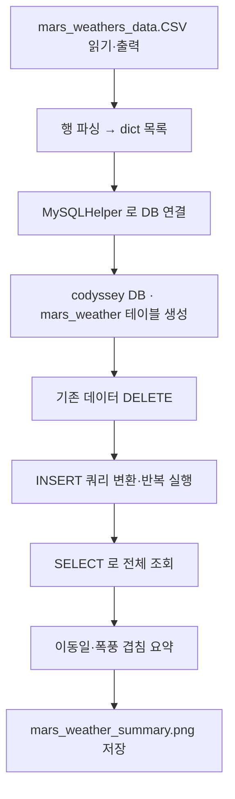

# Day 12 - 화성 날씨 데이터 MySQL 적재 (문제 5)

이동 경로를 정한 뒤, 화성 모래 폭풍 일정이 이동일과 겹치는지 확인하기 위해 미션 컴퓨터에 백업된 날씨 CSV를 MySQL에 저장·분석하는 과제입니다.

> **발표용:** 5분 분량 대본 (코드 설명 위주) → [`SPEAKER_NOTES.md`](./SPEAKER_NOTES.md)

## 파일 구성

| 파일 | 설명 |
|------|------|
| `mars_weather_summary.py` | CSV 읽기, MySQL 적재, 요약 출력, PNG 저장 |
| `mars_weathers_data.CSV` | 화성 날씨 원본 데이터 (1000행) |
| `create_mars_weather.sql` | `mars_weather` 테이블 DDL (Workbench용) |
| `requirements.txt` | `mysql-connector-python` 의존성 |
| `mars_weather_summary.png` | 실행 후 생성되는 요약 그래프 이미지 |

## 사전 준비

1. **MySQL** 설치 및 서버 실행
2. **MySQL Workbench** 설치 후 `localhost` 연결
3. Python 패키지 설치

```bash
cd day12
python3 -m pip install -r requirements.txt
```

> macOS 에서 `pip: command not found` 가 나오면 `pip` 대신 **`python3 -m pip`** 를 사용하세요.

4. **`day12/db_config.local.py`** 에 Workbench와 **동일한** `user` / `password` 입력  
   - 로컬 PC Workbench 연결명이 `dvely` 이면 `user`도 `dvely`  
   - 비워 두면 실행 시 터미널에서 비밀번호를 물어봅니다

### `Access denied (1045)` 가 나올 때

- **root 비밀번호가 아니라**, Workbench에서 실제로 접속되는 계정 비밀번호를 써야 합니다.
- `db_config.local.py`를 열고 `password`에 Workbench 로그인 비밀번호를 넣은 뒤 다시 실행하세요.

## CSV 데이터 형식

```
weather_id,mars_date,temp,stom
1,2050-01-01,21.4,56
2,2050-01-02,24.67,53
...
```

| 컬럼 | 설명 |
|------|------|
| `weather_id` | CSV 행 번호 (DB INSERT 시 사용 안 함, AUTO_INCREMENT) |
| `mars_date` | 화성 날짜 (`YYYY-MM-DD`) |
| `temp` | 온도 (소수 가능 → DB에는 정수로 반올림) |
| `stom` | 폭풍 지표 (**storm 오타**). `0` = 폭풍 없음, `0` 아님 = 폭풍 있음 |

> 코드에서 `stom` 헤더를 자동으로 `storm`으로 인식합니다.

## 테이블 스키마 (`mars_weather`)

```sql
CREATE TABLE mars_weather (
    weather_id INT NOT NULL AUTO_INCREMENT,
    mars_date DATETIME NOT NULL,
    temp INT NOT NULL,
    storm INT NOT NULL,
    PRIMARY KEY (weather_id)
);
```

- `weather_id`: PK, AUTO_INCREMENT
- `mars_date`: NOT NULL
- `temp`, `storm`: INT

## 실행 방법

```bash
cd day12
python3 mars_weather_summary.py
```

## 코드 흐름



### 1단계: CSV 읽기 (`read_and_print_csv`)

- `csv.reader`로 파일을 읽고 **전체 내용을 화면에 출력**
- `utf-8-sig` 인코딩으로 BOM 처리
- `FileNotFoundError`, `OSError` 예외 처리

### 2단계: 파싱 (`_parse_csv_rows`)

- 헤더 `weather_id,mars_date,temp,stom` 인식
- `stom` → `storm` 오타 보정
- `temp` 소수(21.4) → `int(round(...))` 로 정수 변환
- 1000건의 `{mars_date, temp, storm}` dict 생성

### 3단계: DB 준비 (`setup_database`)

- `create_mars_weather.sql` 있으면 읽어 실행 (DROP 후 CREATE 포함)
- 없으면 내장 DDL로 테이블 생성
- 재실행을 위해 `DELETE FROM mars_weather`

### 4단계: INSERT (`insert_records`)

- 각 레코드를 문자열 INSERT SQL로 변환 (`row_to_insert_sql`)
- 예시:

```sql
INSERT INTO mars_weather (mars_date, temp, storm) VALUES ('2050-01-01', 21, 56);
```

- 변환된 SQL을 출력하고 `helper.execute()`로 **한 건씩 반복 실행**

### 5단계: 요약 (`build_summary_text`)

- 마지막 기록 날짜 **+ 1일** = 이동 예정일
- 이동일에 `storm != 0` 이면 **「이동일 모래 폭풍 주의」**
- 평균 온도, 폭풍 일수, 폭풍 날짜 목록 출력

### 6단계: PNG 저장 (`save_summary_png`)

- **matplotlib 미사용** — `struct`, `zlib`로 PNG 직접 생성 (과제 제약)
- 상단: 요약 텍스트 / 하단: 온도 꺾은선 + 폭풍일 빨간 띠

## 보너스: `MySQLHelper` 클래스

| 메서드 | 역할 |
|--------|------|
| `connect()` | MySQL 연결 |
| `execute(query)` | SQL 실행 |
| `fetchall()` | SELECT 결과 반환 |
| `commit()` | 커밋 |
| `close()` | 연결 종료 |

## 과제 요구사항 체크리스트

| 항목 | 구현 |
|------|------|
| `mars_weather` 테이블 (PK, AUTO_INCREMENT, NOT NULL) | `create_mars_weather.sql` + `setup_database` |
| Python → MySQL 연결 | `MySQLHelper` + `mysql.connector` |
| CSV 읽기·내용 확인 출력 | `read_and_print_csv` |
| INSERT 쿼리 변환·반복 실행 | `row_to_insert_sql` + `insert_records` |
| `mars_weather_summary.py` 저장 | ✓ |
| 결과 PNG 저장 | `mars_weather_summary.png` |
| MySQLHelper 보너스 | ✓ |
| PEP 8, 함수 snake_case, 클래스 CapWord | ✓ |

## 검증 시 발견·수정한 이슈

기존 코드는 아래 이유로 **제공 CSV에서 동작하지 않았습니다.** 수정 반영 완료.

1. **헤더 오타**: CSV 컬럼명이 `storm`이 아니라 `stom` → 헤더 인식 실패
2. **temp 소수**: `21.4` 등 → `int()` 변환 시 `ValueError`
3. **헤더 미스킵**: 위 오류로 fallback 분기에서 헤더 행까지 데이터로 처리 시도

수정 후 `mars_weathers_data.CSV` **1000건** 정상 파싱 확인.

## 발표 시 강조 포인트

1. **스토리 연결**: 이동 예정일과 `storm == 0` 인 날을 비교해 폭풍 위험 판단
2. **INSERT 반복**: CSV 한 줄 → INSERT 문자열 → execute 루프 (과제 핵심)
3. **데이터 품질**: 실제 파일의 `stom` 오타·소수 온도를 코드에서 방어적으로 처리
4. **PNG without matplotlib**: 외부 그래프 라이브러리 없이 표준 라이브러리만으로 결과 이미지 생성

## MySQL Workbench에서 수동 확인

```sql
USE codyssey;
SELECT COUNT(*) FROM mars_weather;          -- 1000
SELECT * FROM mars_weather WHERE storm = 0; -- 폭풍 없는 8일
SELECT mars_date, temp, storm FROM mars_weather ORDER BY mars_date DESC LIMIT 5;
```

---

## 발표 대본 (약 5~7분)

> 아래는 그대로 읽거나, 본인 말투로 바꿔서 쓰면 됩니다.  
> **데모 순서:** 스토리 → 파일 소개 → Workbench 테이블 → 터미널 실행 → PNG·Workbench SELECT

---

### 1. 인사·주제 소개 (30초)

안녕하세요. 오늘 발표 주제는 Codyssey **문제5, 「내일 날씨는 맑음」** 입니다.

이 과제는 화성 기지에서 **이동 경로는 정했지만, 이동 날짜에 모래 폭풍이 겹치면 장비가 고장 나고 임무가 끝날 수 있다**는 스토리에서 출발합니다.  
그래서 미션 컴퓨터에 백업된 **화성 날씨 CSV**를 읽어 **MySQL에 저장**하고, **이동해도 안전한지** 판단한 뒤, 결과를 **PNG 이미지**로 남기는 것이 목표입니다.

저는 이를 `day12` 폴더의 `mars_weather_summary.py` 한 파일 중심으로 구현했습니다.

---

### 2. 스토리와 기술 목표 연결 (1분)

스토리에서 한송희 박사는 **이동하려는 날짜**와 **모래 폭풍이 일어나는 날짜**가 겹치는지 확인해야 합니다.

기술적으로는 다음을 수행합니다.

1. **MySQL**과 **MySQL Workbench**로 DB 환경을 준비합니다.
2. `mars_weather` 테이블을 만듭니다. 컬럼은 `weather_id`, `mars_date`, `temp`, `storm` 입니다.
3. 과제에서 제공한 **`mars_weathers_data.csv`** 를 Python으로 읽습니다.
4. 각 행을 **INSERT 쿼리 문자열로 바꾼 뒤**, 반복해서 실행합니다.
5. DB에서 다시 조회해 **이동 예정일의 폭풍 여부**를 요약하고, **`mars_weather_summary.png`** 로 저장합니다.

과제 제약은 **CSV·이미지 처리는 Python 표준 라이브러리만** 쓰고, **MySQL 연결만** `mysql.connector` 같은 외부 라이브러리를 쓰는 것입니다. 그래서 PNG는 matplotlib 없이 `struct`와 `zlib`로 직접 만들었습니다.

---

### 3. 필요한 파일과 역할 (1분 30초)

발표 때는 **「어떤 파일이 왜 필요했는지」** 를 이렇게 설명하면 됩니다.

#### 3-1. 과제·실행에 꼭 필요한 파일

| 파일 | 종류 | 역할 |
|------|------|------|
| **`mars_weathers_data.csv`** | 과제 제공 데이터 | 화성 날씨 원본. 1000행. `mars_date`, `temp`, `storm`(헤더는 `stom` 오타) |
| **`mars_weather_summary.py`** | 제출·실행 메인 코드 | CSV 읽기 → MySQL INSERT → 요약 → PNG 저장 |
| **`create_mars_weather.sql`** | DDL 스크립트 | Workbench에서 `mars_weather` 테이블을 수동으로 만들 때 사용. 코드도 이 파일을 읽어 테이블 생성 |
| **`requirements.txt`** | 의존성 목록 | `mysql-connector-python` 설치용 (MySQL만 외부 패키지 허용) |

#### 3-2. 로컬 환경용 파일 (과제 로직과 분리)

| 파일 | 역할 |
|------|------|
| **`db_config.local.py`** | MySQL `user`, `password` 등 접속 정보. Workbench와 동일한 계정 사용. git에 올리지 않음 |

#### 3-3. 실행 후 생성되는 파일

| 파일 | 역할 |
|------|------|
| **`mars_weather_summary.png`** | 온도 추이 그래프 + 이동일·폭풍 요약이 담긴 **최종 결과물** |

#### 3-4. 참고·선행했던 것 (코드베이스·과제 명세)

| 참고 대상 | 어디서 썼는지 |
|-----------|----------------|
| **Codyssey 문제5 수행 과제 문서** | 테이블 스키마, INSERT 반복, 파일명 `mars_weather_summary.py`, PNG 출력 요구 |
| **PEP 8 스타일 가이드** | 함수 `snake_case`, 클래스 `CapWord`, 작은따옴표 문자열 |
| **`day02/mars_base_inventory.py`** | CSV 파일 경로 처리, `open` + 읽기, 스크립트 기준 폴더(`_script_dir`) 패턴 |
| **MySQL 공식 문서 / `mysql.connector`** | `connect`, `execute`, `commit`, `fetchall` 사용 방식 |
| **이 README의 mermaid 흐름도** | 전체 파이프라인 정리·발표용 |

과제에서 **직접 주어진 파일**은 CSV 하나이고, 나머지 `.py`, `.sql`은 그 요구사항을 만족하도록 **직접 작성**한 파일입니다.

---

### 4. 코드 구조 설명 (2분)

`mars_weather_summary.py`는 크게 **6단계**로 동작합니다.

**① CSV 읽기 — `read_and_print_csv`**  
과제에서 「내용을 확인하는 코드」를 요구했기 때문에, `csv.reader`로 파일을 읽으면서 **한 줄씩 화면에 출력**합니다.

**② 파싱 — `_parse_csv_rows`**  
실제 데이터 파일에는 `stom`이라는 **헤더 오타**가 있고, 온도는 `21.4`처럼 **소수**로 들어옵니다.  
그래서 `stom`을 `storm`으로 인식하고, `int(round(float(...)))`로 DB의 INT 컬럼에 맞게 변환합니다. 총 **1000건**이 나옵니다.

**③ DB 연결 — `MySQLHelper` (보너스 과제)**  
`connect`, `execute`, `fetchall`, `commit`, `close`를 묶어서, SQL 실행 코드를 짧게 유지했습니다.

**④ 테이블 준비 — `setup_database`**  
`codyssey` 데이터베이스와 `mars_weather` 테이블을 만들고, 재실행을 위해 기존 행을 `DELETE` 합니다.  
`weather_id`는 **AUTO_INCREMENT PK**, `mars_date`는 **NOT NULL** 입니다.

**⑤ INSERT 반복 — `row_to_insert_sql` + `insert_records`**  
과제 핵심입니다. CSV 한 줄을 예를 들어 이런 SQL로 바꿉니다.

```sql
INSERT INTO mars_weather (mars_date, temp, storm) VALUES ('2050-01-01', 21, 56);
```

이 문자열을 출력한 뒤, `for` 루프로 **한 건씩 `execute`** 합니다.

**⑥ 요약·PNG — `build_summary_text` + `save_summary_png`**  
DB에서 날짜순으로 다시 읽습니다. **마지막 기록 날짜 + 1일**을 이동 예정일로 보고, 그날 `storm`이 0이 아니면 「이동일 모래 폭풍 주의」, 아니면 스토리 제목처럼 **「내일 날씨는 맑음」** 에 가깝게 「폭풍 없음」으로 표시합니다.  
PNG는 표준 라이브러리만으로 그립니다.

---

### 5. 라이브 데모 멘트 (1분)

이제 실행을 보여드리겠습니다.

```bash
cd day12
python mars_weather_summary.py
```

1. 터미널에 **CSV 1000줄**이 출력됩니다.  
2. 이어서 **INSERT 쿼리**가 여러 줄 출력됩니다.  
3. **한글 요약**에 기록 수, 평균 온도, 이동 예정일, 폭풍 여부가 나옵니다.  
4. 같은 폴더에 **`mars_weather_summary.png`** 가 생성됩니다.

Workbench에서는 아래로 데이터가 들어갔는지 확인할 수 있습니다.

```sql
USE codyssey;
SELECT COUNT(*) FROM mars_weather;
```

1000이 나오면 INSERT가 정상입니다.

---

### 6. 트러블슈팅·구현 포인트 (30초, 질문 대비)

발표 중 질문이 나올 수 있는 부분입니다.

- **왜 `root`가 아니라 `dvely` 계정인가?**  
  로컬 Workbench에 등록된 접속이 `dvely`였기 때문에 `db_config.local.py`에 맞췄습니다.
- **왜 CSV 헤더가 `stom`인가?**  
  데이터 오타로 보이며, 코드에서 `storm` 별칭으로 처리했습니다.
- **왜 matplotlib을 안 썼는가?**  
  과제에서 CSV·일반 처리는 표준 라이브러리만 허용하기 때문입니다.

---

### 7. 마무리 (20초)

정리하면, 이 과제는 **파일(CSV) → 관계형 DB(MySQL) → 분석·시각화(PNG)** 로 이어지는 **데이터 파이프라인**을 연습하는 문제입니다.

화성이라는 스토리 안에서 **「내일 이동해도 되는가」** 를 데이터로 판단한다는 점이 핵심이고, 구현의 핵심은 **INSERT 쿼리 변환과 반복 실행**, 그리고 **`MySQLHelper`로 DB 접근을 정리한 것**입니다.

이상으로 발표 마치겠습니다. 질문 받겠습니다.

---

## 발표 체크리스트 (당일 아침)

- [ ] MySQL80 서비스 실행 중
- [ ] `db_config.local.py` 비밀번호 설정
- [ ] `python mars_weather_summary.py` 한 번 성공해 둠
- [ ] `mars_weather_summary.png` 열어서 화면에 띄울 준비
- [ ] Workbench에서 `SELECT COUNT(*) FROM mars_weather` 미리 확인
- [ ] INSERT 한 줄 예시·테이블 스키마 슬라이드 또는 README 해당 절 열어 두기
