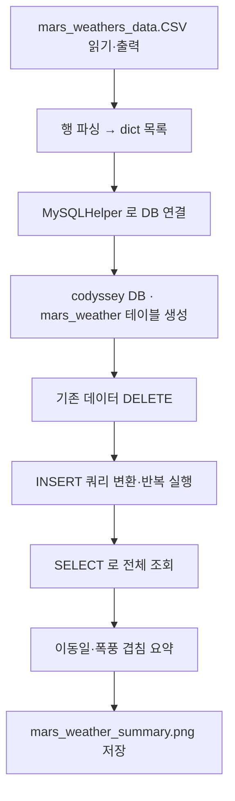

# Day 12 - 화성 날씨 데이터 MySQL 적재 (문제 5)

이동 경로를 정한 뒤, 화성 모래 폭풍 일정이 이동일과 겹치는지 확인하기 위해 미션 컴퓨터에 백업된 날씨 CSV를 MySQL에 저장·분석하는 과제입니다.

## 파일 구성

| 파일 | 설명 |
|------|------|
| `mars_weather_summary.py` | CSV 읽기, MySQL 적재, 요약 출력, PNG 저장 |
| `mars_weathers_data.CSV` | 화성 날씨 원본 데이터 (1000행) |
| `create_mars_weather.sql` | `mars_weather` 테이블 DDL (Workbench용) |
| `requirements.txt` | `mysql-connector-python` 의존성 |
| `mars_weather_summary.png` | 실행 후 생성되는 요약 그래프 이미지 |

## 사전 준비

1. **MySQL** 설치 및 서버 실행
2. **MySQL Workbench** 설치 후 `localhost` 연결
3. Python 패키지 설치

```bash
cd day12
python3 -m pip install -r requirements.txt
```

> macOS 에서 `pip: command not found` 가 나오면 `pip` 대신 **`python3 -m pip`** 를 사용하세요.

4. `mars_weather_summary.py` 상단 `DB_CONFIG`에서 `password` 등을 본인 환경에 맞게 수정

## CSV 데이터 형식

```
weather_id,mars_date,temp,stom
1,2050-01-01,21.4,56
2,2050-01-02,24.67,53
...
```

| 컬럼 | 설명 |
|------|------|
| `weather_id` | CSV 행 번호 (DB INSERT 시 사용 안 함, AUTO_INCREMENT) |
| `mars_date` | 화성 날짜 (`YYYY-MM-DD`) |
| `temp` | 온도 (소수 가능 → DB에는 정수로 반올림) |
| `stom` | 폭풍 지표 (**storm 오타**). `0` = 폭풍 없음, `0` 아님 = 폭풍 있음 |

> 코드에서 `stom` 헤더를 자동으로 `storm`으로 인식합니다.

## 테이블 스키마 (`mars_weather`)

```sql
CREATE TABLE mars_weather (
    weather_id INT NOT NULL AUTO_INCREMENT,
    mars_date DATETIME NOT NULL,
    temp INT NOT NULL,
    storm INT NOT NULL,
    PRIMARY KEY (weather_id)
);
```

- `weather_id`: PK, AUTO_INCREMENT
- `mars_date`: NOT NULL
- `temp`, `storm`: INT

## 실행 방법

```bash
cd day12
python3 mars_weather_summary.py
```

## 코드 흐름



### 1단계: CSV 읽기 (`read_and_print_csv`)

- `csv.reader`로 파일을 읽고 **전체 내용을 화면에 출력**
- `utf-8-sig` 인코딩으로 BOM 처리
- `FileNotFoundError`, `OSError` 예외 처리

### 2단계: 파싱 (`_parse_csv_rows`)

- 헤더 `weather_id,mars_date,temp,stom` 인식
- `stom` → `storm` 오타 보정
- `temp` 소수(21.4) → `int(round(...))` 로 정수 변환
- 1000건의 `{mars_date, temp, storm}` dict 생성

### 3단계: DB 준비 (`setup_database`)

- `create_mars_weather.sql` 있으면 읽어 실행 (DROP 제외)
- 없으면 내장 DDL로 테이블 생성
- 재실행을 위해 `DELETE FROM mars_weather`

### 4단계: INSERT (`insert_records`)

- 각 레코드를 문자열 INSERT SQL로 변환 (`row_to_insert_sql`)
- 예시:

```sql
INSERT INTO mars_weather (mars_date, temp, storm) VALUES ('2050-01-01', 21, 56);
```

- 변환된 SQL을 출력하고 `helper.execute()`로 **한 건씩 반복 실행**

### 5단계: 요약 (`build_summary_text`)

- 마지막 기록 날짜 **+ 1일** = 이동 예정일
- 이동일에 `storm != 0` 이면 **「이동일 모래 폭풍 주의」**
- 평균 온도, 폭풍 일수, 폭풍 날짜 목록 출력

### 6단계: PNG 저장 (`save_summary_png`)

- **matplotlib 미사용** — `struct`, `zlib`로 PNG 직접 생성 (과제 제약)
- 상단: 요약 텍스트 / 하단: 온도 꺾은선 + 폭풍일 빨간 띠

## 보너스: `MySQLHelper` 클래스

| 메서드 | 역할 |
|--------|------|
| `connect()` | MySQL 연결 |
| `execute(query)` | SQL 실행 |
| `fetchall()` | SELECT 결과 반환 |
| `commit()` | 커밋 |
| `close()` | 연결 종료 |

## 과제 요구사항 체크리스트

| 항목 | 구현 |
|------|------|
| `mars_weather` 테이블 (PK, AUTO_INCREMENT, NOT NULL) | `create_mars_weather.sql` + `setup_database` |
| Python → MySQL 연결 | `MySQLHelper` + `mysql.connector` |
| CSV 읽기·내용 확인 출력 | `read_and_print_csv` |
| INSERT 쿼리 변환·반복 실행 | `row_to_insert_sql` + `insert_records` |
| `mars_weather_summary.py` 저장 | ✓ |
| 결과 PNG 저장 | `mars_weather_summary.png` |
| MySQLHelper 보너스 | ✓ |
| PEP 8, 함수 snake_case, 클래스 CapWord | ✓ |

## 검증 시 발견·수정한 이슈

기존 코드는 아래 이유로 **제공 CSV에서 동작하지 않았습니다.** 수정 반영 완료.

1. **헤더 오타**: CSV 컬럼명이 `storm`이 아니라 `stom` → 헤더 인식 실패
2. **temp 소수**: `21.4` 등 → `int()` 변환 시 `ValueError`
3. **헤더 미스킵**: 위 오류로 fallback 분기에서 헤더 행까지 데이터로 처리 시도

수정 후 `mars_weathers_data.CSV` **1000건** 정상 파싱 확인.

## 발표 시 강조 포인트

1. **스토리 연결**: 이동 예정일과 `storm == 0` 인 날을 비교해 폭풍 위험 판단
2. **INSERT 반복**: CSV 한 줄 → INSERT 문자열 → execute 루프 (과제 핵심)
3. **데이터 품질**: 실제 파일의 `stom` 오타·소수 온도를 코드에서 방어적으로 처리
4. **PNG without matplotlib**: 외부 그래프 라이브러리 없이 표준 라이브러리만으로 결과 이미지 생성

## MySQL Workbench에서 수동 확인

```sql
USE codyssey;
SELECT COUNT(*) FROM mars_weather;          -- 1000
SELECT * FROM mars_weather WHERE storm = 0; -- 폭풍 없는 8일
SELECT mars_date, temp, storm FROM mars_weather ORDER BY mars_date DESC LIMIT 5;
```
