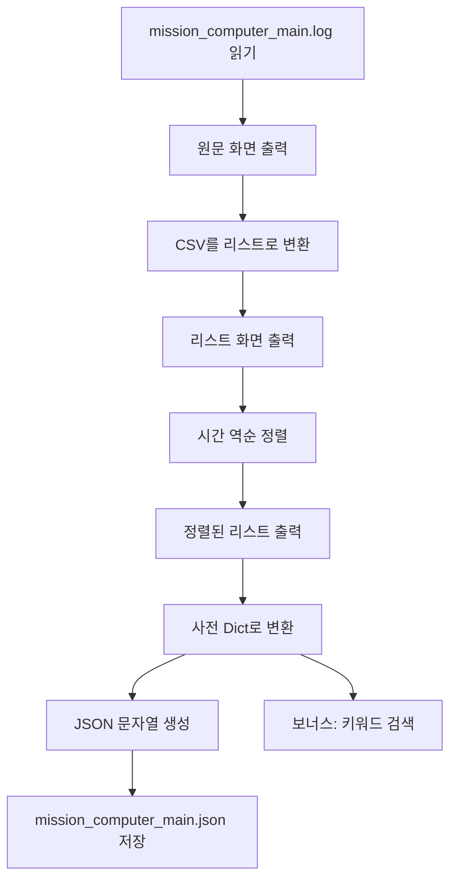

# Day 13 - 미션 컴퓨터 로그 시스템 복구 (문제 2)

화성 기지 사고 이후 미션 컴퓨터의 로그를 체계적으로 분석·저장하기 위한 Python 과제입니다.  
(day01 문제 1에서 다룬 로그를 CSV로 파싱하고 JSON으로 저장하는 **문제 2** 과제)

## 파일 구성

| 파일 | 설명 |
|------|------|
| `mission_log_parser.py` | CSV 파싱, 리스트·사전 변환, JSON 저장, 키워드 검색 |
| `mission_computer_main.log` | 미션 컴퓨터 원본 로그 (CSV 형식) |
| `mission_computer_main.json` | `mission_log_parser.py` 실행 후 생성되는 JSON 결과 |

## 로그 파일 형식

`mission_computer_main.log`는 **콤마(`,`)로 구분된 CSV** 형식입니다.

```
timestamp,event,message
2023-08-27 10:00:00,INFO,Rocket initialization process started.
```

- 1열: `YYYY-MM-DD HH:MM:SS` 형식의 타임스탬프
- 2열: 이벤트 레벨 (INFO 등)
- 3열: 상세 메시지

파서는 **첫 번째 콤마**만 기준으로 나누어 `[시간, 'event,message']` 형태의 리스트로 변환합니다.  
첫 줄 헤더(`timestamp,event,message`)는 자동으로 건너뜁니다.

## 실행 방법

```bash
cd day13
python3 mission_log_parser.py
```

실행 후 키워드 입력 프롬프트가 나오면 `Oxygen` 등 검색어를 입력합니다.

## `mission_log_parser.py` 코드 흐름

전체 처리는 **읽기 → 파싱 → 정렬 → 사전 변환 → JSON 저장 → 검색** 순서로 진행됩니다.



### 1단계: 파일 읽기 (`read_log_file`)

- `open()`으로 로그 파일을 UTF-8 인코딩으로 읽습니다.
- `FileNotFoundError`, `OSError`를 잡아 오류 메시지를 출력하고 `None`을 반환합니다.

### 2단계: 리스트 변환 (`parse_log_to_list`)

- `splitlines()`로 줄 단위 분리 후 빈 줄 제거
- 각 줄을 `split(',', 1)`로 **첫 번째 콤마만** 기준 분리
- 결과: `[['2026-03-18 21:00:01', 'INFO System Booting...'], ...]`

### 3단계: 시간 역순 정렬 (`sort_log_list_reverse`)

- `sorted(..., key=lambda row: row[0], reverse=True)` 사용
- 날짜 문자열이 `YYYY-MM-DD HH:MM:SS` 형식이므로 문자열 비교로 시간 순 정렬 가능
- 가장 최근 로그(폭발 직전)가 리스트 앞쪽에 옵니다.

### 4단계: 사전 변환 (`list_to_dict`)

- 리스트 각 행의 `[시간, 내용]`을 `{시간: 내용}` 형태의 딕셔너리로 변환
- 같은 시간 키가 있으면 마지막 값으로 덮어씁니다.

### 5단계: JSON 저장 (`dict_to_json_string` + `save_json_file`)

- **외부 `json` 모듈 없이** 직접 JSON 문자열 생성
- `"`, `\`, 줄바꿈 등 특수문자는 `escape_json_string`으로 이스케이프
- `mission_computer_main.json`에 저장 (쓰기 실패 시 예외 처리)

### 6단계: 보너스 키워드 검색 (`search_in_dict`)

- `input()`으로 검색어 입력
- 사전의 **값(로그 내용)** 에서 대소문자 무시 검색
- 일치 항목의 시간·내용을 출력

## 데이터 구조 변화 예시

**리스트 (정렬 전)**

```python
[
    ['2026-03-18 21:00:01', 'INFO System Booting...'],
    ['2026-03-18 21:05:22', 'WARNING Oxygen Level 18%'],
    ...
]
```

**리스트 (역순 정렬 후)** — 최신 로그가 맨 앞

```python
[
    ['2026-03-18 21:12:05', 'CRITICAL Explosion Detected'],
    ['2026-03-18 21:12:00', 'CRITICAL Reactor Overheat'],
    ...
]
```

**사전**

```python
{
    '2026-03-18 21:12:05': 'CRITICAL Explosion Detected',
    '2026-03-18 21:12:00': 'CRITICAL Reactor Overheat',
    ...
}
```

## 제약 사항 준수

- Python 3.x, **표준 라이브러리만** 사용 (`os`만 import, `json`/`csv` 미사용)
- PEP 8 스타일 (공백 들여쓰기, `=` 앞뒤 공백, 작은따옴표 문자열)
- 파일 읽기·쓰기 구간 **예외 처리** 포함
- JSON 포맷 **수동 구현** (`escape_json_string`, `dict_to_json_string`)

## 발표 시 강조 포인트

1. **왜 리스트 → 정렬 → 사전인가?**  
   리스트는 순서 있는 원본 데이터, 정렬로 시간 흐름 파악, 사전은 시간 기준 빠른 조회·JSON 저장에 적합합니다.

2. **왜 JSON을 직접 구현했는가?**  
   과제 제약상 외부 패키지 없이 JSON 규격(따옴표, 이스케이프)을 코드로 직접 만듭니다.

3. **사고 분석 관점**  
   역순 정렬 시 `CRITICAL Explosion Detected`가 최상단에 오므로, 폭발 직전 이벤트를 한눈에 확인할 수 있습니다.

4. **보너스 검색**  
   `Oxygen` 검색 시 산소 농도 WARNING 로그를 즉시 찾을 수 있어, 환경 이상 징후 추적에 활용됩니다.
